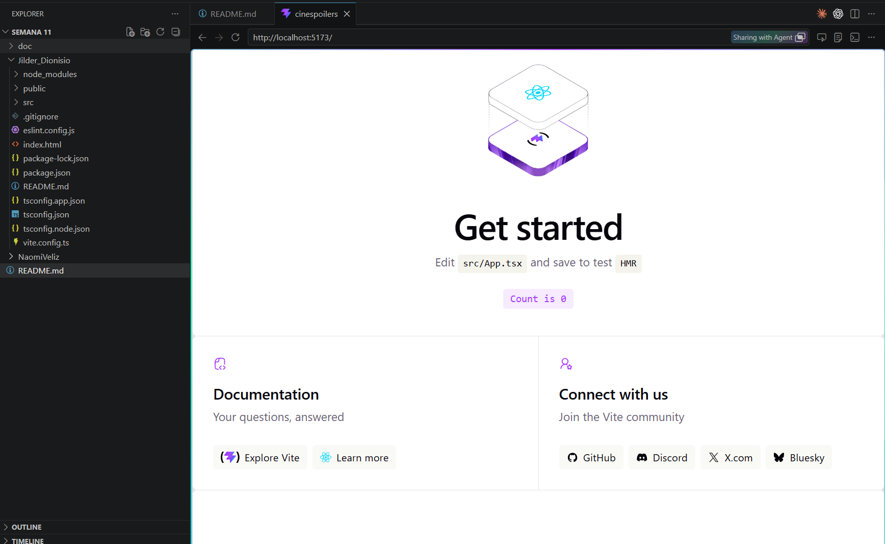
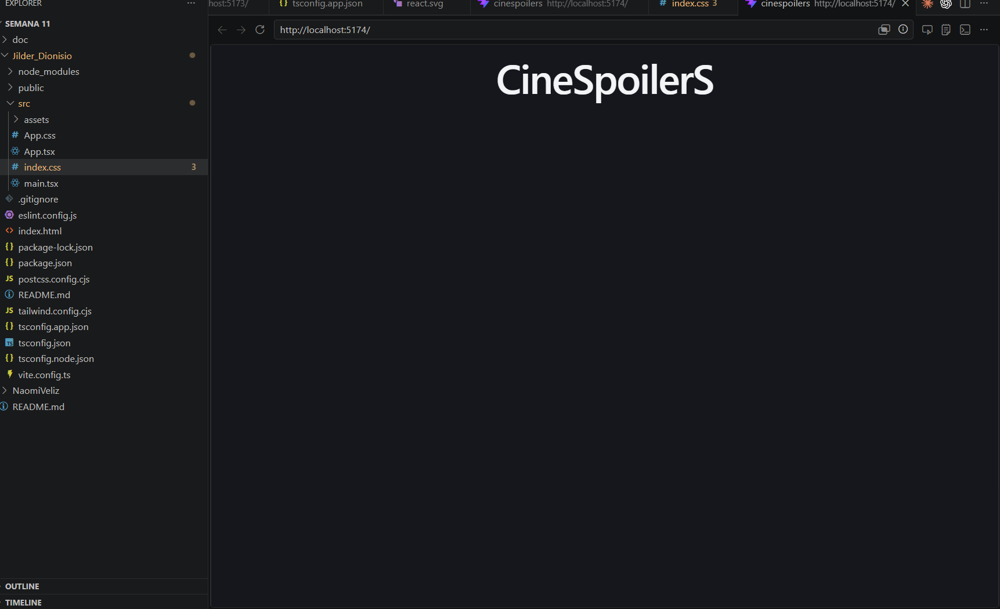
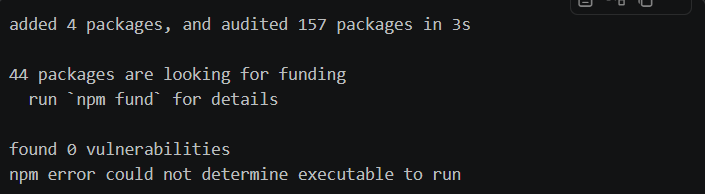
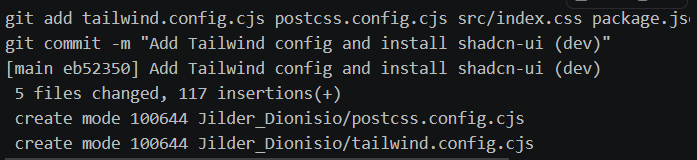
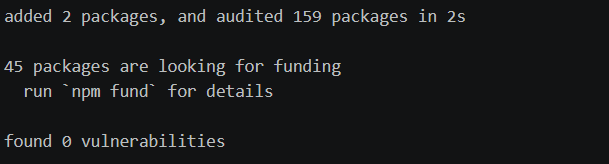
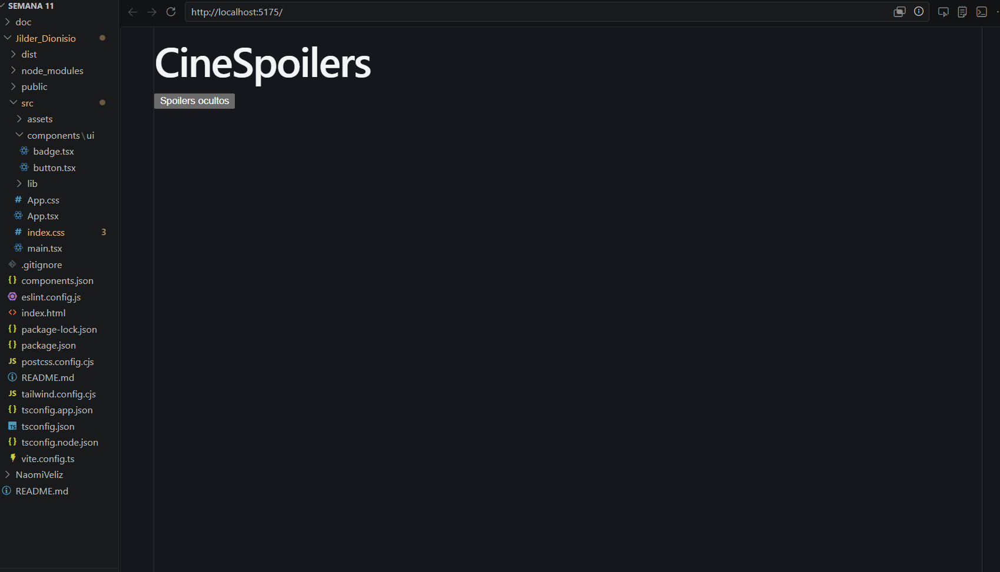
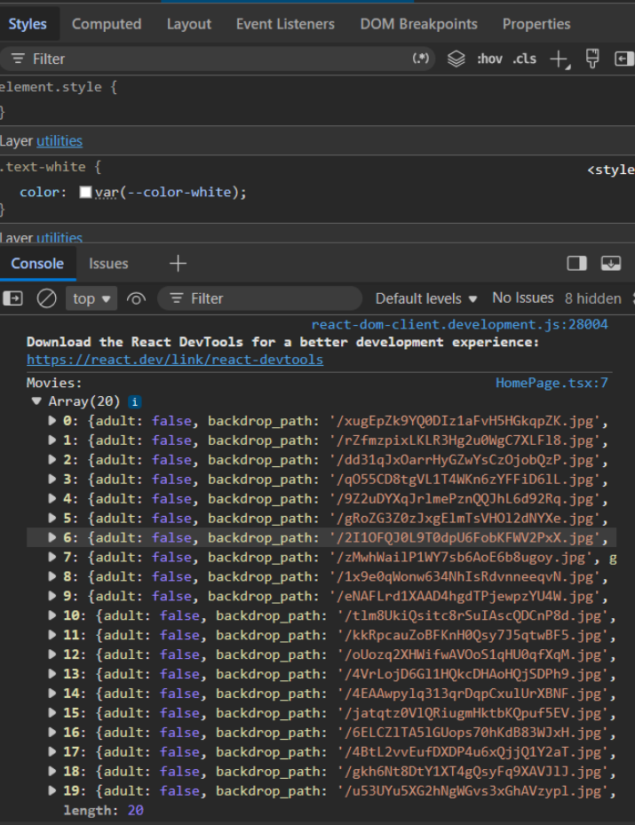
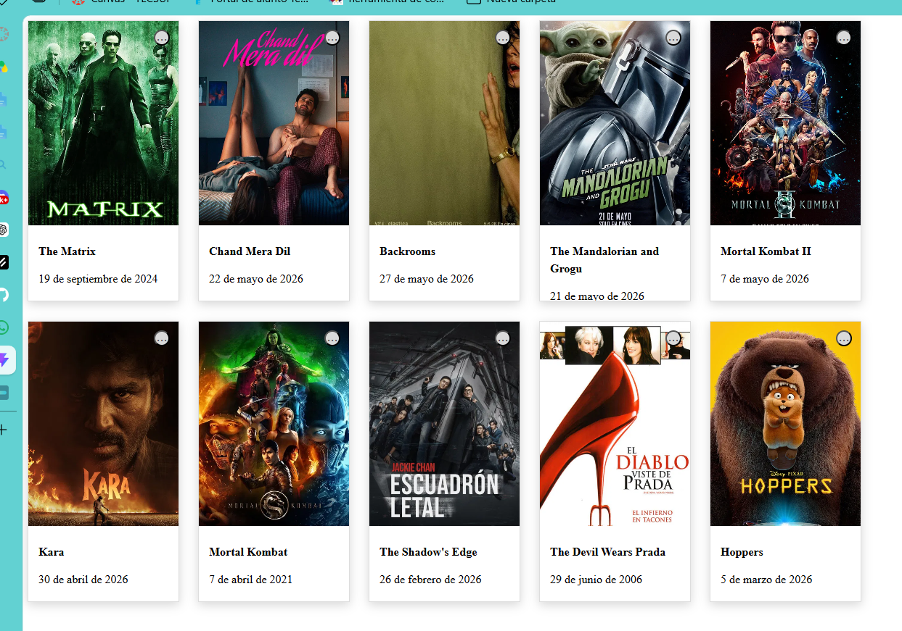

# Semana 11 - DJ

Este repositorio contiene el proyecto de la semana 11 con la aplicación CineSpoilerS, utilizando React, Vite, TypeScript, Tailwind y axios para preparación de consumo de la API de TMDB.

## Introducción

Aquí se encuentra el trabajo realizado hasta ahora, incluyendo la estructura del proyecto, la configuración de entorno y las pruebas de instalación.

## Evidencias

## Jilder Dionisio

- Evidencia 1

-  Evidencia 2

- Evidencia 3

- Evidencia 4

- Evidencia 5

- Evidencia 6

- Evidencia 7

- Evidencia 8 

## Naomi Veliz

- Naom

## Estructura

